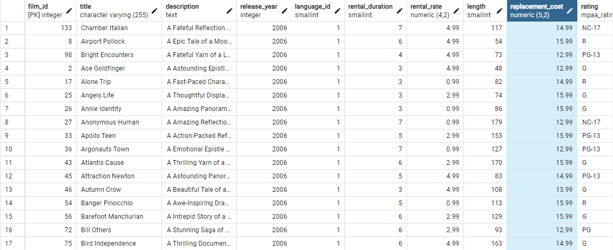
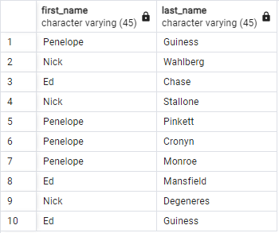
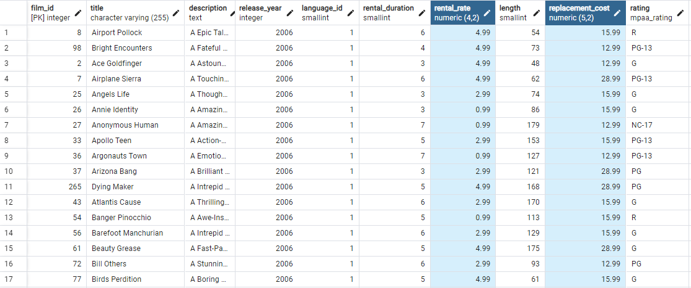

1.SELECT \* FROM film
WHERE replacement_cost BETWEEN 12.99 AND 16.98;

2.SELECT first_name, last_name FROM actor
WHERE first_name IN ('Penelope', 'Nick', 'Ed');

3.SELECT \* FROM film
WHERE rental_rate IN (0.99, 2.99, 4.99) AND replacement_cost IN (12.99, 15.99, 28.99)

